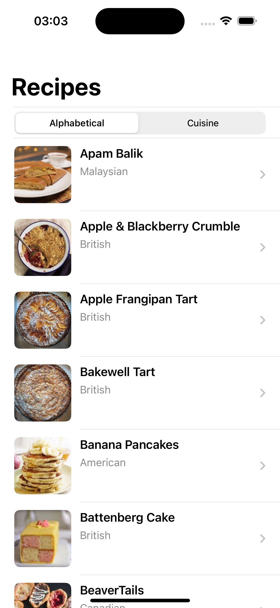
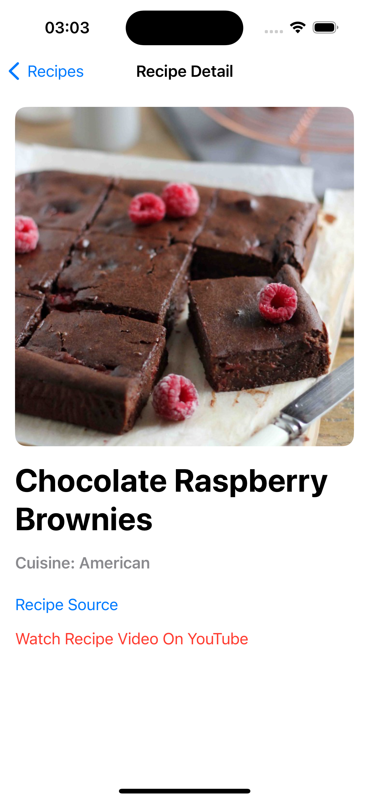

# 📱 RecipeApp – Take Home Project

---

### 📸 Summary

This is a lightweight SwiftUI recipe application that fetches and displays recipes from the provided API.

**Key Features:**

- Displays recipe name, cuisine, and photo
- Manual image caching to disk (no URLCache, no third-party)
- Sort by name or cuisine
- Async/await used throughout
- Pull to refresh
- Graceful handling of malformed/empty data
- Unit and UI test coverage

**Screenshots:**

| List View | Detail View |
|-----------|-------------|
|  |   |

---

### 🎯 Focus Areas

I prioritized:

1. **MVVM structure** – to keep logic clean and testable  
2. **Manual image caching** – to fully meet the "no URLCache / 3rd party" constraint  
3. **Robust error handling** – tested malformed and empty data states  
4. **Testing** – focused unit tests on sorting, data fetch logic, and mocked service responses

I chose these areas because they reflect real-world production concerns like architecture, performance, and testability.

---

### ⏱️ Time Spent

**~1–1.5 hours total**

| Task                            | Time     |
|---------------------------------|----------|
| Project setup + model & API     | 20 min   |
| UI development                  | 30–40 min |
| Manual caching & refresh setup  | 20 min   |
| Unit test setup                 | 15–20 min |

---

### ⚖️ Trade-offs and Decisions

- Built a **custom image cache manager** using `FileManager` instead of relying on URLCache.
- Skipped deep filtering/search to focus on clean data flow and testability.

---

### 🧱 Weakest Part of the Project

- Image caching is minimal: no memory cache, no expiration
- Design is intentionally minimal
- No real-time search or filtering (can be added later)

---

### 📝 Additional Information

- Tested against all 3 endpoints:
  - ✅ Normal JSON
  - ✅ Malformed JSON (throws `.malformedData`)
  - ✅ Empty JSON (shows "No Recipe Found")
- `AppError` used for clean localized error display.
- `RecipeListViewModel` is fully testable with injected service.

✅ No third-party libraries used.  
✅ Fully native SwiftUI + async/await implementation.
